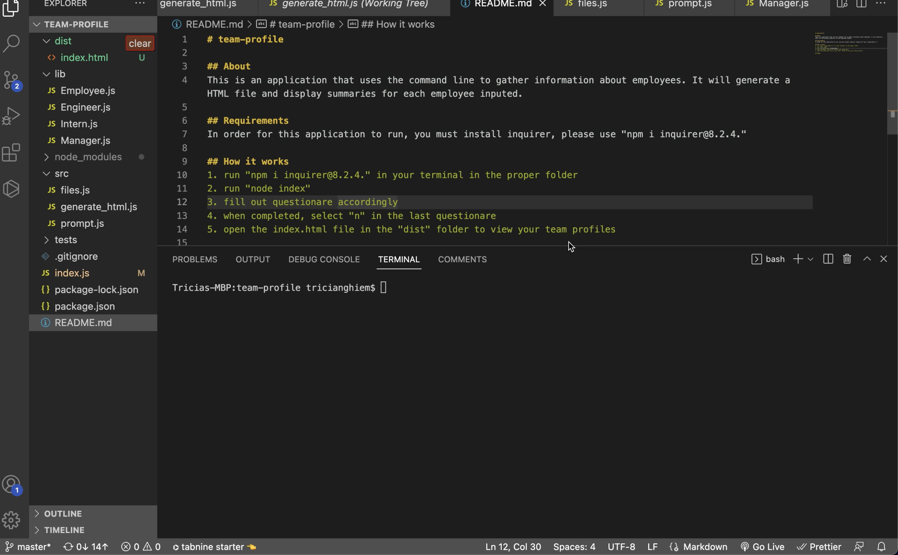

# team-profile

## About
This is an application that uses the command line to gather information about employees. It will generate a HTML file and display summaries for each employee inputed.

## Requirements
In order for this application to run, you must install inquirer, please use "npm i inquirer@8.2.4."

## How it works
1. run "npm i inquirer@8.2.4." in your terminal in the proper folder
2. run "node index"
3. fill out questionare accordingly
4. when completed, select "n" in the last questionare
5. open the index.html file in the "dist" folder to view your team profiles
   
## Video
Click below to watch the video:

Additional Link Here: https://bootcampspot.instructuremedia.com/embed/86b25ffc-b7f9-4623-b554-ee16edace4a0